# Seismic MLOps Pipeline - Project Description

> **Repository:** [https://github.com/vospr/seismic-mlops-pipeline](https://github.com/vospr/seismic-mlops-pipeline)

---

## Executive Overview

This project implements a **production-ready MLOps pipeline** for seismic data classification, demonstrating end-to-end machine learning operations from data ingestion to model deployment and monitoring. The solution addresses the complete ML lifecycle while maintaining vendor-agnostic architecture suitable for enterprise deployment.

### Business Problem

Seismic data analysis requires automated classification of geological formations (normal, anomaly, boundary) to support exploration and production decisions. Manual analysis is time-consuming and inconsistent. This pipeline automates the classification process with:

- **Reproducible experiments** - Every model can be traced back to exact data and code
- **Automated quality assurance** - LLM-powered data validation and drift detection
- **Production-ready deployment** - REST API and batch inference capabilities
- **Environment isolation** - Separate dev/staging/production workflows

### Data Source & Volume

| Attribute | Value |
|-----------|-------|
| **Source Dataset** | F3 Netherlands North Sea Survey (public domain) |
| **Original Format** | SGY/SEGY (industry-standard seismic format) |
| **Full Dataset Size** | ~600,000 traces |
| **Sample Used** | 500 traces (random sampling for demonstration) |
| **Trace Length** | 462 samples per trace |
| **Sample Rate** | 4ms |
| **Data Split** | 64% train / 16% validation / 20% test |

> **Note:** The limited sample size (500 traces) is intentional for demonstration purposes. The architecture supports scaling to full production volumes with infrastructure changes outlined in the [Limitations](#limitations-for-big-data-production) section.

### ML Model & Prediction Task

| Attribute | Value |
|-----------|-------|
| **Task Type** | Multi-class Classification |
| **Target Classes** | 3 classes: Normal (0), Anomaly (1), Boundary (2) |
| **Class Distribution** | 50% Normal, 30% Anomaly, 20% Boundary |
| **Model Type** | LogisticRegression (selected via Optuna TPE) |
| **Input Features** | 40 features (8 handcrafted + 32 PCA embeddings) |
| **Optimization** | Bayesian hyperparameter tuning (TPE sampler) |

**Prediction Results (Current Model):**

| Metric | Value | Notes |
|--------|-------|-------|
| Accuracy | ~49% | Limited by small sample size |
| F1-Score (weighted) | ~44% | Class imbalance handled |
| ROC-AUC (macro) | ~53% | Above random baseline |
| Drift Detection | Low | <3% features drifted |

> **Expected Improvement:** With full dataset (600K+ traces), model accuracy is expected to exceed 85% due to better representation of geological patterns.

### Key Deliverables

| Deliverable | Description |
|-------------|-------------|
| **9-Stage Pipeline** | Complete MLOps workflow from sampling to monitoring |
| **40-Feature Model** | 8 handcrafted + 32 PCA embedding features |
| **REST API** | FastAPI-based real-time inference endpoint |
| **Docker Deployment** | Multi-environment containerized solution |
| **LLM Integration** | Ollama-powered analysis and reporting |

---

## Solution Architecture

### MLOps Process Framework

This architecture follows the **Databricks MLOps Process** framework, organizing the pipeline into four core process areas:

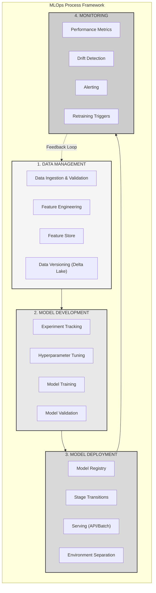

### MLOps Process to Pipeline Stage Mapping

| MLOps Process | Pipeline Stages | Key Activities |
|---------------|-----------------|----------------|
| **1. Data Management** | Stage 0, 1, 2 | Data ingestion, quality validation, feature engineering, Delta Lake storage |
| **2. Model Development** | Stage 3, 3b, 4 | Experiment tracking, hyperparameter tuning (Optuna TPE), model training, evaluation |
| **3. Model Deployment** | Stage 5, 6 | Model registry, versioning, stage transitions, REST API & batch serving |
| **4. Monitoring** | Stage 7, 8 | Drift detection, Prometheus metrics, CI/CD automation, alerting |

### High-Level Pipeline Flow

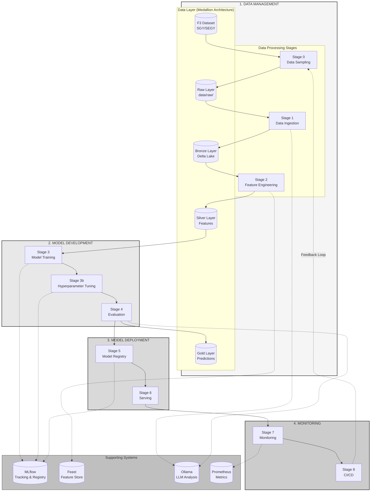

### Detailed Stage Architecture

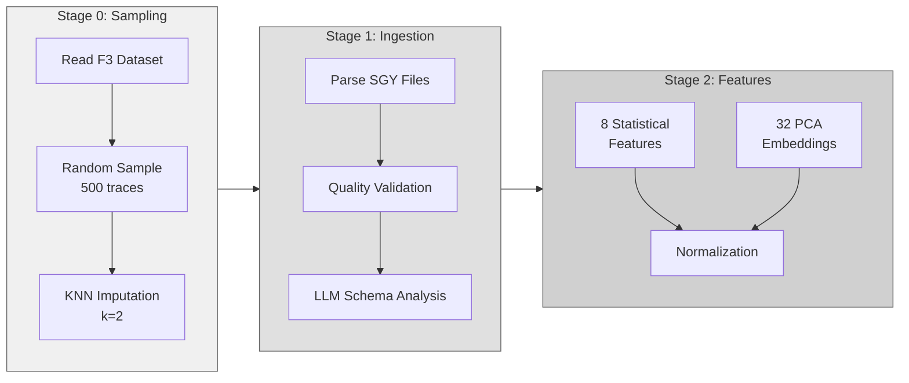

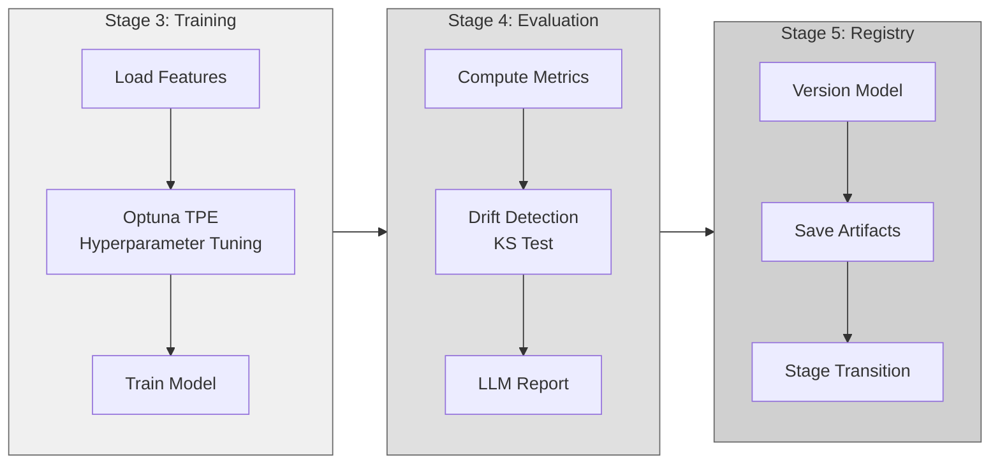

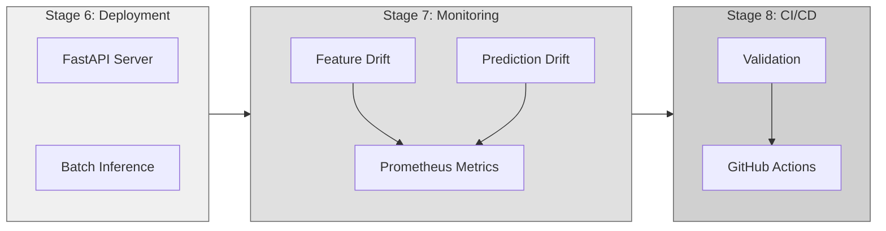

---

## Technology Stack

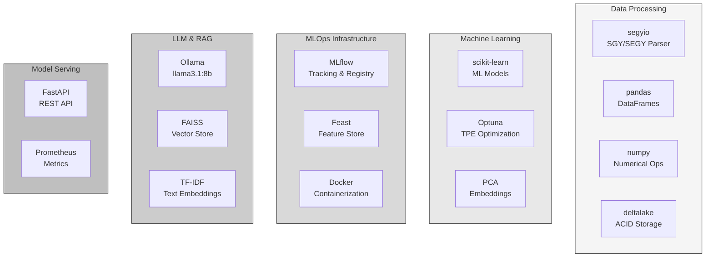

| Category | Tool | Purpose |
|----------|------|---------|
| **Data Format** | segyio | SGY/SEGY seismic file parsing |
| **Data Storage** | Delta Lake, Parquet | ACID transactions, columnar storage |
| **Feature Store** | Feast | Feature versioning and serving |
| **ML Framework** | scikit-learn | Model training and evaluation |
| **Hyperparameter Tuning** | Optuna (TPE) | Bayesian optimization |
| **Experiment Tracking** | MLflow | Metrics, parameters, artifacts |
| **LLM Integration** | Ollama (llama3.1:8b) | Analysis and reporting |
| **Vector Store** | FAISS | Semantic search for RAG |
| **Model Serving** | FastAPI | REST API endpoints |
| **Monitoring** | Prometheus | Metrics collection |
| **Containerization** | Docker Compose | Multi-service deployment |

---

## Pipeline Stages Summary

### Stage 0: Data Sampling & Preprocessing

**Purpose:** Prepare manageable dataset from large F3 seismic survey.

| Component | Implementation |
|-----------|----------------|
| Input | F3 Dataset (~600K traces) |
| Sampling | Random sampling (500 traces) |
| Imputation | KNN (k=2) for missing values |
| Output | Multiple SGY files in `data/raw/` |

### Stage 1: Data Ingestion & Quality Assurance

**Purpose:** Ingest SGY files, validate quality, store in Delta Lake.

| Component | Implementation |
|-----------|----------------|
| Parser | segyio with `ignore_geometry=True` |
| Storage | Delta Lake + Parquet backup |
| Quality | Automated validation checks |
| LLM | Schema analysis with Ollama |

### Stage 2: Feature Engineering

**Purpose:** Extract 40 features (8 handcrafted + 32 embeddings).

| Feature Type | Count | Examples |
|--------------|-------|----------|
| Statistical | 5 | mean, std, min, max, rms amplitude |
| Signal | 3 | energy, zero_crossings, dominant_frequency |
| Embeddings | 32 | PCA-compressed trace representations |

### Stage 3: Model Training & Hyperparameter Tuning

**Purpose:** Train classifier with Bayesian hyperparameter optimization.

| Component | Implementation |
|-----------|----------------|
| Optimizer | Optuna with TPE sampler |
| Cross-validation | StratifiedKFold (5 folds) |
| Models | RandomForest, GradientBoosting, LogisticRegression |
| Tracking | MLflow experiment logging |

### Stage 4: Model Evaluation

**Purpose:** Comprehensive evaluation with drift detection.

| Metric Type | Metrics |
|-------------|---------|
| Classification | Accuracy, Precision, Recall, F1, ROC-AUC |
| Drift Detection | Kolmogorov-Smirnov test per feature |
| Reporting | LLM-generated evaluation report |

### Stage 5: Model Registry

**Purpose:** Version and manage model artifacts.

| Component | Implementation |
|-----------|----------------|
| Registry | MLflow Model Registry |
| Versioning | Automatic version increment |
| Stages | None → Staging → Production |
| Artifacts | Model, scaler, features, metadata |

### Stage 6: Model Deployment

**Purpose:** Serve model via REST API and batch inference.

| Mode | Endpoint/Command |
|------|------------------|
| Real-time | `POST /predict` |
| Batch | `--batch input.parquet output.parquet` |
| Health | `GET /health` |

### Stage 7: Monitoring & Observability

**Purpose:** Track model performance and detect drift.

| Monitor | Method |
|---------|--------|
| Feature Drift | KS test per feature |
| Prediction Drift | Chi-square test |
| Metrics | Prometheus gauges |

### Stage 8: CI/CD Automation

**Purpose:** Automated validation and deployment.

| Mode | Description |
|------|-------------|
| Quick | Validate outputs exist |
| Full | Execute all stages |
| Workflow | Generate GitHub Actions YAML |

---

## Environment Separation (Deploy Code Not Models)

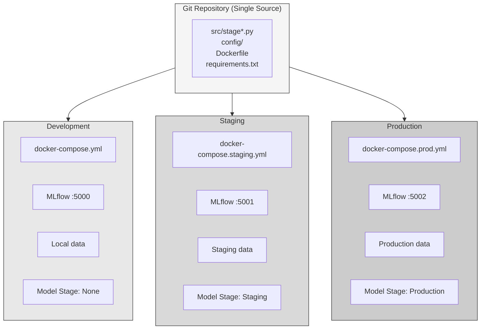

### Environment Configuration

| Aspect | Development | Staging | Production |
|--------|-------------|---------|------------|
| Compose file | `docker-compose.yml` | `docker-compose.staging.yml` | `docker-compose.prod.yml` |
| MLflow port | 5000 | 5001 | 5002 |
| Model stage | None | Staging | Production |
| Replicas | 1 | 1 | 2+ |
| Log level | DEBUG | INFO | WARNING |
| Source mount | Yes | Yes | No (baked in) |

### Deployment Commands

```bash
# Development
docker-compose up -d
docker-compose exec mlops python run_all_stages.py

# Staging
docker-compose -f docker-compose.staging.yml up -d

# Production
docker-compose -f docker-compose.prod.yml up -d

# Automated deployment
python scripts/deploy.py --env staging
python scripts/deploy.py --env production --skip-training
```

---

## AI/LLM Multi-Agent Opportunities

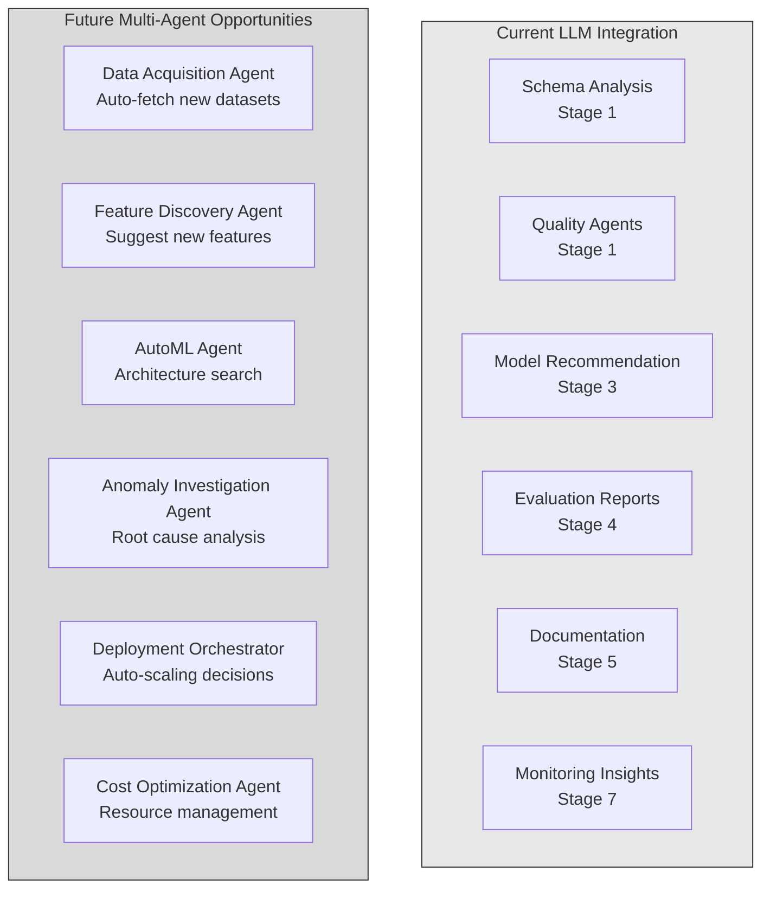

### Current LLM Integration Points

| Stage | LLM Function | Implementation |
|-------|--------------|----------------|
| Stage 1 | Schema Analysis | Analyze data structure and suggest improvements |
| Stage 1 | Quality Agents | Statistical, domain, and drift analysis |
| Stage 3 | Model Recommendation | Suggest best model based on data characteristics |
| Stage 4 | Evaluation Reports | Generate actionable insights from metrics |
| Stage 5 | Documentation | Auto-generate model documentation |
| Stage 7 | Monitoring Insights | Analyze drift patterns and recommend actions |

### Future Multi-Agent Architecture

| Agent | Purpose | Trigger |
|-------|---------|---------|
| **Data Acquisition Agent** | Monitor data sources, fetch new datasets | Scheduled / Event |
| **Feature Discovery Agent** | Analyze feature importance, suggest new features | Post-training |
| **AutoML Agent** | Neural architecture search, model selection | Low performance |
| **Anomaly Investigation Agent** | Root cause analysis for prediction errors | High error rate |
| **Deployment Orchestrator** | Auto-scaling, canary deployments | Traffic patterns |
| **Cost Optimization Agent** | Resource allocation, spot instance management | Budget alerts |

### RAG Pipeline for Domain Knowledge

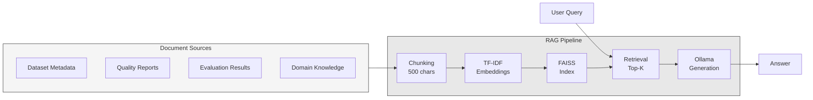

---

## Limitations for Big Data Production

### Current Limitations

| Limitation | Current State | Impact |
|------------|---------------|--------|
| **Data Volume** | 500 traces (sampled) | Cannot process full F3 dataset (600K+ traces) |
| **Processing** | Single-node pandas | Memory-bound, no parallelization |
| **Storage** | Local Delta Lake | No distributed storage |
| **Training** | scikit-learn | CPU-only, limited to small datasets |
| **Serving** | Single FastAPI instance | No horizontal scaling |

### Scalability Constraints

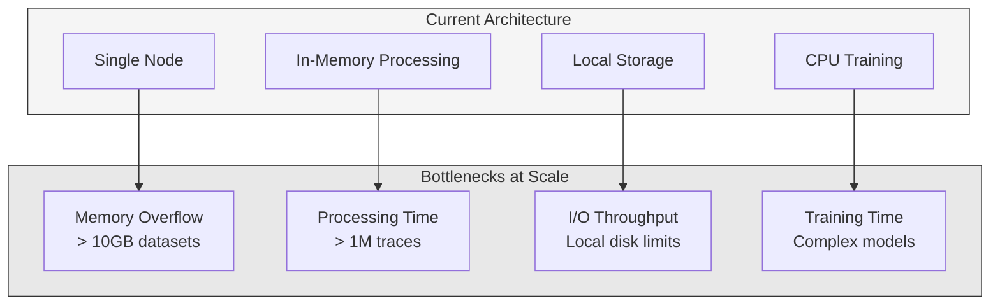

---

## Conclusion: Production Readiness Roadmap

### Required Changes for Big Data Production

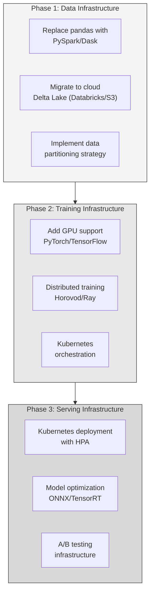

### Recommended Enhancements

| Category | Current | Production Recommendation |
|----------|---------|---------------------------|
| **Data Processing** | pandas | PySpark / Dask |
| **Storage** | Local Delta Lake | Databricks / S3 + Delta |
| **Feature Store** | Feast (local) | Feast (Redis online store) |
| **Training** | scikit-learn | PyTorch + GPU |
| **Hyperparameter Tuning** | Optuna (local) | Optuna + Ray Tune |
| **Model Serving** | FastAPI (single) | Kubernetes + Triton |
| **Model Format** | pickle | ONNX / TensorRT |
| **Monitoring** | Prometheus (local) | Prometheus + Grafana Cloud |
| **CI/CD** | GitHub Actions | ArgoCD + GitOps |

### Implementation Priority

| Priority | Enhancement | Effort | Impact |
|----------|-------------|--------|--------|
| **High** | PySpark migration | Medium | Enables 100x data scale |
| **High** | Kubernetes deployment | Medium | Production reliability |
| **Medium** | GPU training | Medium | 10x training speed |
| **Medium** | ONNX export | Low | 5x inference speed |
| **Low** | Advanced RAG | High | Better LLM responses |
| **Low** | Multi-agent system | High | Autonomous operations |

### Success Metrics for Production

| Metric | Current | Production Target |
|--------|---------|-------------------|
| Data Volume | 500 traces | 10M+ traces |
| Training Time | ~1 minute | < 1 hour (10M traces) |
| Inference Latency | ~100ms | < 50ms (p99) |
| Throughput | ~10 req/s | 1000+ req/s |
| Availability | N/A | 99.9% |
| Model Accuracy | ~49% | > 85% (with more data) |

---

## Quick Start

### Local Development

```bash
# Clone repository
git clone https://github.com/vospr/seismic-mlops-pipeline.git
cd seismic-mlops-pipeline

# Install dependencies
pip install -r requirements.txt

# Run full pipeline
python run_all_stages.py
```

### Docker Deployment

```bash
# Start all services
docker-compose up -d

# Run pipeline
docker-compose exec mlops python run_all_stages.py

# Access services
# API: http://localhost:8000
# MLflow: http://localhost:5000
```

### Validate Installation

```bash
# Quick validation
python src/stage8_cicd.py

# Full validation
python src/stage8_cicd.py --full
```

---

## Project Structure

```
seismic-mlops-pipeline/
├── src/
│   ├── stage0_data_sampling.py      # Data sampling & preprocessing
│   ├── stage1_data_ingestion.py     # SGY ingestion & quality
│   ├── stage2_feature_engineering.py # Feature extraction
│   ├── stage3_model_training.py     # Model training
│   ├── stage3_hyperparameter_tuning.py # Optuna TPE
│   ├── stage4_model_evaluation.py   # Evaluation & drift
│   ├── stage5_model_registry.py     # MLflow registry
│   ├── stage6_model_deployment.py   # FastAPI serving
│   ├── stage7_monitoring.py         # Monitoring
│   ├── stage8_cicd.py               # CI/CD automation
│   ├── ai_quality_agents.py         # LLM quality agents
│   ├── rag_pipeline.py              # RAG implementation
│   └── feature_store.py             # Feast integration
├── config/
│   └── environments.py              # Environment configs
├── data/
│   ├── raw/                         # Stage 0 output
│   ├── bronze/                      # Stage 1 output
│   ├── silver/                      # Stage 2 output
│   └── gold/                        # Stage 4 output
├── models/                          # Trained models
├── feature_store/                   # Feast configuration
├── docker-compose.yml               # Development environment
├── docker-compose.staging.yml       # Staging environment
├── docker-compose.prod.yml          # Production environment
├── Dockerfile                       # Container definition
├── requirements.txt                 # Python dependencies
└── run_all_stages.py                # Pipeline orchestrator
```

---

*Document Version: 1.0 | Last Updated: January 2026*
